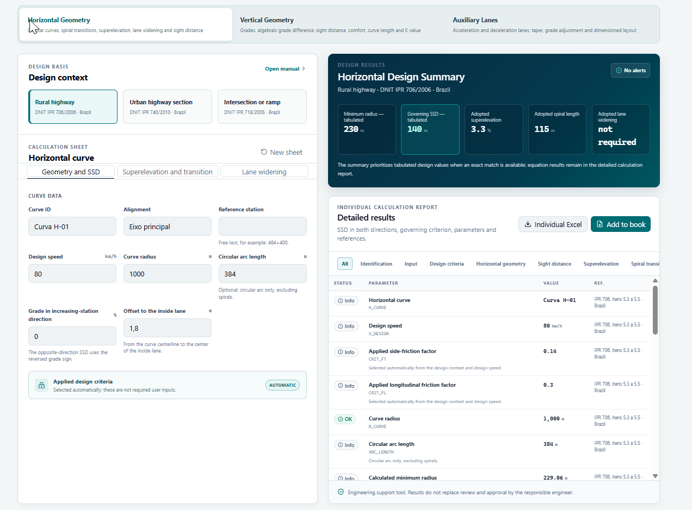
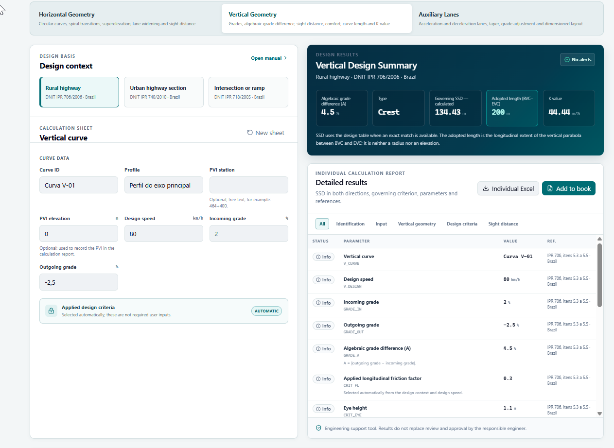
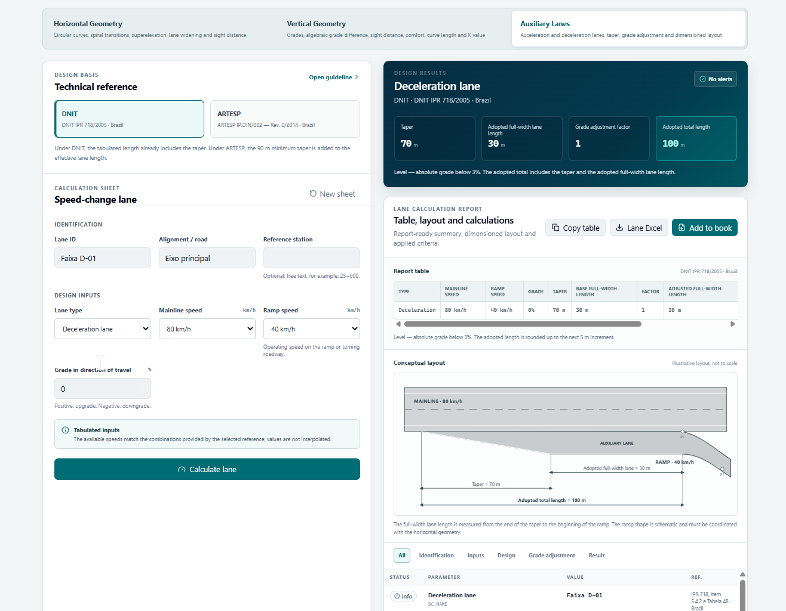

# Road Geometric Design Toolkit

**Road engineering criteria translated into an interactive calculation workflow.**

A free web application for road geometric design calculations, design checks and calculation reports, developed by **Filipe Berbert**, a civil engineer focused on road design and engineering automation.

[Open the application](https://memoria-geometrica-dnit.projetos-rodoviarios.workers.dev/) · [Connect on LinkedIn](https://www.linkedin.com/in/filipe-b-6b13359a/)

The interface supports **Portuguese and English**. Calculations currently use **Brazilian references**, including DNIT manuals and the ARTESP option for speed-change lanes. Selecting English changes the presentation language; it does not select a different country's design criteria. AASHTO, DMRB and Austroads calculations are not implemented.

This repository presents the project, its engineering workflow and capabilities. The application source code is not included.

## Why I built this

Road design work often involves moving between reference manuals, spreadsheets, design inputs and calculation reports. Repeating that process makes it harder to keep assumptions, results and supporting references together.

I developed this project to bring part of that workflow into a single browser application: select the engineering context, enter the geometry, inspect the results and assemble a calculation book for review.

It is also part of my development as an engineer who builds automation tools. The central challenge is translating engineering criteria into explicit inputs, calculations, checks and traceable outputs while keeping the designer responsible for interpreting the results.

## Current features

| Module | Supported workflow |
| --- | --- |
| Horizontal geometry | Horizontal curve calculations, transition geometry, superelevation, curve widening and sight-distance checks. |
| Vertical geometry | Grades, crest and sag curves, stopping sight distance, curve length and the K parameter. |
| Speed-change lanes | Acceleration and deceleration lane calculations, taper and effective length, grade adjustments and a schematic layout. |
| Design context | Brazilian references for rural highways, urban highway sections and intersections or ramps, depending on the module. |
| Results and review | Summary panels, detailed calculation rows, reference information and review indicators. |
| Project calculation book | Collect horizontal, vertical and auxiliary-lane records with project identification. |
| Excel export | Export individual calculation reports and the consolidated project calculation book. |
| Language | Portuguese and English presentation, retaining the implemented Brazilian engineering references. |

## Engineering workflow

1. **Select the context.** Choose the module and applicable Brazilian reference.
2. **Define the inputs.** Enter the design speed and geometric parameters required for that calculation.
3. **Inspect the results.** Review the summary, detailed values, reference notes and warning indicators.
4. **Exercise engineering judgment.** Check assumptions and interpret any item requiring review before adopting the result.
5. **Build the calculation book.** Add the records needed for the project and export the results to Excel.

The application supports calculations alongside road design and CAD workflows. It is a browser tool, not a Civil 3D add-in; direct model synchronization is not part of the features presented here.

## Application structure

The archived distribution dated September 9, 2026 contains a React browser interface, JavaScript calculation logic, bundled styles and an Excel export library. This overview describes that distribution; it is not a source-code walkthrough or confirmation of the currently deployed version.

| Responsibility | Role in the application |
| --- | --- |
| Interface and language | Presents module inputs, summaries, detailed results and translated labels. |
| Reference selection | Selects the available Brazilian calculation context. |
| Calculation logic | Processes horizontal, vertical and auxiliary-lane inputs and produces results and review information. |
| Calculation book | Collects project records and retains the book in browser storage. |
| Export | Builds Excel workbooks from individual records or the consolidated book. |

This organization provides a starting point for future development around additional references. It does not imply that international standards have already been implemented or validated.

## Technical scope

The application identifies the relevant manual or guideline within each calculation context. The distribution inspected for this presentation includes references to **IPR 706**, **IPR 740**, **IPR 718** and an **ARTESP speed-change-lane guideline**.

This is an independent engineering support tool, not an official DNIT or ARTESP application. Results require verification by the responsible engineer against the applicable source documents and project requirements. This portfolio makes no claim of certification, comprehensive standards coverage or measured productivity gains.

## Roadmap

Potential next steps, rather than released capabilities or delivery commitments:

- Publish worked examples showing inputs, reference criteria, intermediate results and interpretation.
- Expand documented verification cases and make calculation limitations easier to inspect.
- Refine technical English and the presentation of exported reports.
- Explore structured data exchange with road design workflows.
- Evaluate additional standards only as a separate implementation and validation effort.

## About the developer

**Filipe Berbert Miranda**  
**Road Design Engineer | Digital Engineering | Automation | Computational Workflows**

I am a Brazilian civil engineer with experience in road geometric design and infrastructure projects. My work combines practical design experience, Civil 3D workflows and the development of tools that reduce repetitive engineering tasks.

This project brings together my road design background and my growing software development practice. I am interested in opportunities involving road design, digital engineering and automation for transportation infrastructure.

[LinkedIn](https://www.linkedin.com/in/filipe-b-6b13359a/) · [GitHub](https://github.com/TheVoidDweller) · [Live application](https://memoria-geometrica-dnit.projetos-rodoviarios.workers.dev/)

## Feedback

Technical feedback is welcome, especially on calculation clarity, reference traceability, English terminology and repetitive road design tasks that could benefit from automation. Please use fictional or anonymized examples when describing a workflow.

## Application screenshots

### Horizontal geometry

### Vertical geometry

### Speed-change lanes

