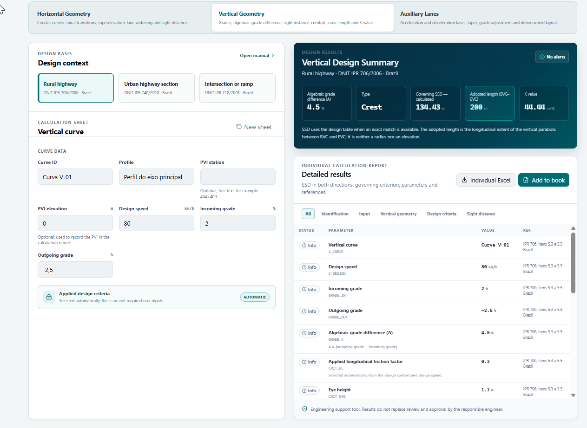
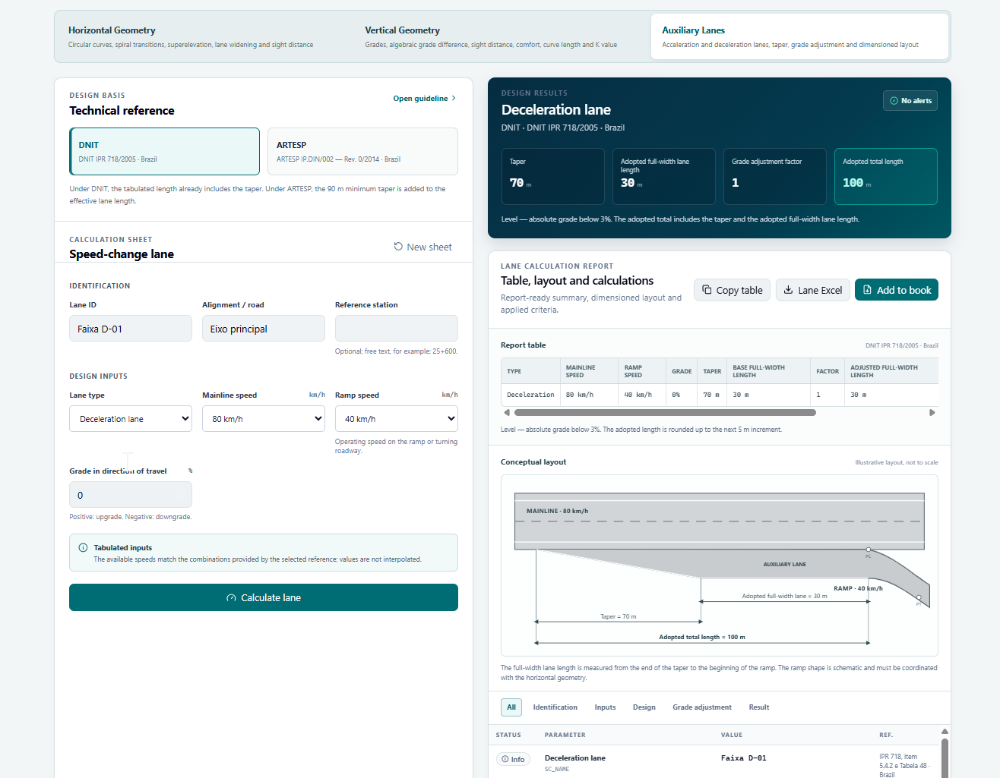

# Road Geometric Design Toolkit

**Road engineering criteria translated into an interactive, traceable calculation workflow.**

A free browser application for highway geometric design calculations, design checks and calculation reports, developed by **Filipe Berbert**, a civil engineer working on road design and engineering automation.

[Open the application](https://memoria-geometrica-dnit.projetos-rodoviarios.workers.dev/) · [Connect on LinkedIn](https://www.linkedin.com/in/filipe-b-6b13359a/)

The interface is available in **Portuguese and English**. Calculations use **Brazilian design references** (DNIT manuals, plus an ARTESP option for speed-change lanes). Switching to English changes the presentation language, not the design criteria. AASHTO, DMRB and Austroads criteria are not implemented.

This repository presents the project, its engineering method and worked verification examples. The application source code is not included.

## Why I built this

Road design work often means moving between design manuals, spreadsheets, design inputs and calculation reports. Repeating that cycle makes it harder to keep assumptions, results and references together.

This project brings part of that workflow into one browser application: select the design context, enter the geometry, inspect the results and assemble a calculation book for review.

It is also part of my development as an engineer who builds automation tools. The central challenge is turning design criteria into explicit inputs, calculations, checks and traceable outputs, while the designer stays responsible for interpreting the results.

## For readers outside Brazil

**DNIT** is Brazil's federal highway agency. Its IPR manuals are the national reference for highway design: IPR 706 for rural highways, IPR 740 for urban sections and IPR 718 for intersections. **ARTESP** is the São Paulo State transport regulator.

The design checks follow the same structure as AASHTO's *A Policy on Geometric Design of Highways and Streets* (the Green Book). The differences are mainly in parameter values and tabulated criteria:

| Check | As implemented (rural, IPR 706) | AASHTO Green Book (metric) |
| --- | --- | --- |
| Minimum radius | R = V² / [127 (e + f)], with emax and side friction f by design speed | Same point-mass equation; different friction and emax tables |
| Stopping sight distance | 0.7 V + V² / [255 (f + i)], friction-based | 0.278 V t + V² / [254 (a/9.81 ± G)], with t = 2.5 s and a = 3.4 m/s². The tool already uses this form for urban sections (IPR 740). |
| Crest vertical curve (S < L) | L = A S² / [200 (√h₁ + √h₂)²], with h₁ = 1.10 m and h₂ = 0.15 m | Same equation, with h₁ = 1.08 m and h₂ = 0.60 m (L = A S² / 658) |
| Sag vertical curve (S < L) | L = A S² / [200 (h + S tan β)], with h = 0.61 m and β = 1° | Same headlight-control form (h = 0.60 m, β = 1°) |
| Design control | K = L / A | K = L / A |

Extending the tool to another standard is therefore mostly a matter of parameter sets, tables and independent validation. The roadmap below reflects that.

## Current features

| Module | Supported workflow |
| --- | --- |
| Horizontal geometry | Horizontal curves, spiral transitions, superelevation, lane widening and sight-distance checks. |
| Vertical geometry | Grades, crest and sag curves, stopping sight distance, curve length and the K value. |
| Speed-change lanes | Acceleration and deceleration lanes, taper and full-width lengths, grade adjustment and a dimensioned schematic layout. |
| Design context | Brazilian references for rural highways, urban highway sections and intersections or ramps, depending on the module. |
| Results and review | Summary panels, detailed calculation rows with references, and review indicators. |
| Project calculation book | Horizontal, vertical and speed-change lane records collected under a project identification. |
| Excel export | Individual calculation reports and the consolidated project calculation book. |
| Language | Portuguese and English presentation, keeping the implemented Brazilian references. |

## Worked verification examples

Each case below is one of the screenshot cases, recalculated by hand from the equations and tables the tool cites and compared with the application's output. This checks that the implementation is consistent with its references. It is not an independent certification.

### Case H-01: horizontal curve, rural highway (IPR 706)

Inputs: design speed V = 80 km/h, radius R = 1,000 m, emax = 8 %, grade 0 %.

| Item | Hand calculation | Tool |
| --- | --- | --- |
| Criteria selected for 80 km/h | Side friction f = 0.14; longitudinal friction fL = 0.30 | 0.14; 0.30 |
| Minimum radius (equation) | 80² / [127 (0.08 + 0.14)] = 229.06 m | 229.06 m |
| Minimum radius (adopted) | Tabulated value, IPR 706 Quadro 5.4.3.2: 230 m | 230 m |
| Stopping sight distance (equation) | 0.7 × 80 + 80² / [255 (0.30 + 0)] = 139.66 m | 139.66 m |
| Stopping sight distance (adopted) | Tabulated value, IPR 706 Quadro 5.3.1.4: 140 m | 140 m |
| Superelevation | 8 × [2 (229.06/1,000) − (229.06/1,000)²] = 3.25 %, rounded up to 0.1 % | 3.3 % |
| Spiral length | Governed by the optical-flow criterion L ≥ R/9 (applied for R > 800 m): 111.1 m, rounded up to 5 m | 115 m |

View the vertical curve case

### Case V-01: crest vertical curve, rural highway (IPR 706)

Inputs: V = 80 km/h, incoming grade +2.0 %, outgoing grade −2.5 %.

| Item | Hand calculation | Tool |
| --- | --- | --- |
| Algebraic grade difference | A = \|−2.5 − 2.0\| = 4.5 % | 4.5 % |
| Stopping sight distance, increasing direction (approach grade +2.0 %) | 0.7 × 80 + 80² / [255 (0.30 + 0.020)] = 134.43 m | 134.43 m |
| Stopping sight distance, decreasing direction (approach grade +2.5 %) | 0.7 × 80 + 80² / [255 (0.30 + 0.025)] = 133.22 m | 133.22 m |
| Length for sight distance (S < L) | 4.5 × 134.43² / [200 (√1.10 + √0.15)²] = 197.16 m | 197.16 m |
| Adopted length | Greater of 197.16 m and the 48 m operational minimum, rounded up to 5 m | 200 m |
| K value | 200 / 4.5 = 44.44 m/%, above the tabulated minimum of 29 for 80 km/h | 44.44 m/% |

View the speed-change lane case

### Case D-01: deceleration lane (IPR 718)

Inputs: mainline 80 km/h, ramp 40 km/h, level grade.

| Item | Hand calculation | Tool |
| --- | --- | --- |
| Total length, including taper | Tabulated value, IPR 718 Table 48: 100 m | 100 m |
| Taper | Tabulated value for 80 km/h: 70 m | 70 m |
| Full-width length | 100 − 70 = 30 m | 30 m |
| Grade adjustment factor | Level grade (below 3 %): 1.0 | 1.0 |
| Adopted total length | 70 + 30 × 1.0 = 100 m, rounded up to 5 m | 100 m |

Screenshots show the interface in English. The calculation references remain Brazilian, and some example record names are in Portuguese.

## Engineering workflow

1. **Select the context.** Choose the module and the applicable Brazilian reference.
2. **Define the inputs.** Enter the design speed and the geometric parameters for that calculation.
3. **Inspect the results.** Review the summary, detailed values, reference notes and warning indicators.
4. **Exercise engineering judgment.** Check the assumptions and resolve any item flagged for review before adopting a result.
5. **Build the calculation book.** Add the records the project needs and export them to Excel.

The application supports calculations alongside road design and CAD workflows. It is a browser tool, not a Civil 3D add-in, and it does not synchronize with design models.

## Application structure

The application is a React browser interface with JavaScript calculation logic, bundled styles and an Excel export library.

| Responsibility | Role in the application |
| --- | --- |
| Interface and language | Presents module inputs, summaries, detailed results and translated labels. |
| Reference selection | Selects the available Brazilian calculation context. |
| Calculation logic | Processes horizontal, vertical and speed-change lane inputs and produces results and review information. |
| Calculation book | Collects project records and keeps the book in browser storage. |
| Export | Builds Excel workbooks from individual records or the consolidated book. |

Keeping reference selection separate from the calculation logic is what makes additional standards possible. It does not mean that any international standard has been implemented or validated.

## Technical scope

Each calculation row identifies the manual, item or table it relies on. The current references are **IPR 706**, **IPR 740**, **IPR 718** and the **ARTESP IP.DIN/002** guideline for speed-change lanes.

This is an independent engineering support tool, not an official DNIT or ARTESP application. Results must be verified by the responsible engineer against the applicable source documents and project requirements. The project makes no claim of certification, full standards coverage or measured productivity gains.

## Roadmap

These are possible next steps, not released capabilities or delivery commitments:

- Turn the worked verification examples into an automated test suite that runs on every change.
- Add an AASHTO Green Book (metric) parameter set as the first non-Brazilian reference, validated separately against published tables.
- Publish more worked examples, including sag curves, urban sections and acceleration lanes.
- Explore structured data exchange with road design software, for example LandXML alignments.
- Refine technical English and the presentation of exported reports.

## About the developer

**Filipe Berbert Miranda**
**Road Design Engineer | Digital Engineering | Automation | Computational Workflows**

I am a Brazilian civil engineer with experience in road geometric design and infrastructure projects. My work combines practical design experience, Civil 3D workflows and the development of tools that reduce repetitive engineering tasks.

This project brings together my road design background and my growing software development practice. I am interested in opportunities in road design, digital engineering and automation for transportation infrastructure, including international roles and relocation.

[LinkedIn](https://www.linkedin.com/in/filipe-b-6b13359a/) · [GitHub](https://github.com/TheVoidDweller) · [Live application](https://memoria-geometrica-dnit.projetos-rodoviarios.workers.dev/)

## Feedback

Technical feedback is welcome, especially on calculation clarity, reference traceability, English terminology and repetitive road design tasks that could benefit from automation. Please use fictional or anonymized examples when describing a workflow.
